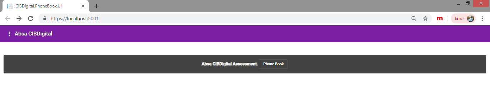
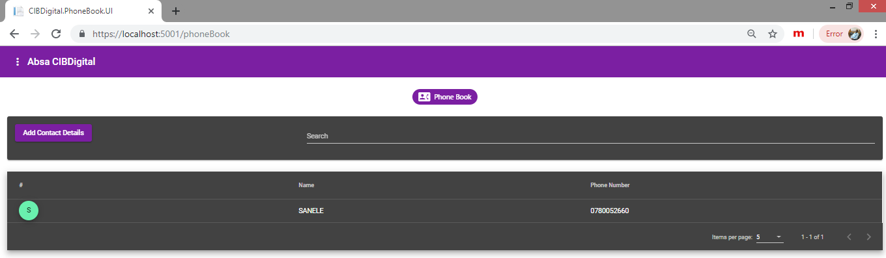

# CIBDigital_Assessment
Absa CIBDigital Assessment
 
Tech:
 
 
Angular/cli 8.0.2 
Angular meterial 
.Net core 2.1 
ORM - Dapper 
Database - MSSQL
 
 
Setup:
 
 
Need a latest npm and nodejs installed.  
Change the connection string on json config file (Development) on .Net core proj  
Import sql schema attached (CIBDigital_SchemaOnly_Script).
 
 
Run the project:
 
 
Build the project 
Run as CIBDigita.PhoneBook.UI, NOT via IISExpress. 
The port may change: please check the port and update the endpoint in (CIBDigital.PhoneBook.UI\ClientApp\src\app\service)current port: 5001
 
 
Functionality:
 
 
Add Entry 
Get Entry 
Search Entry 
No Unit test - no much code
 
 
Screen shots:

 

